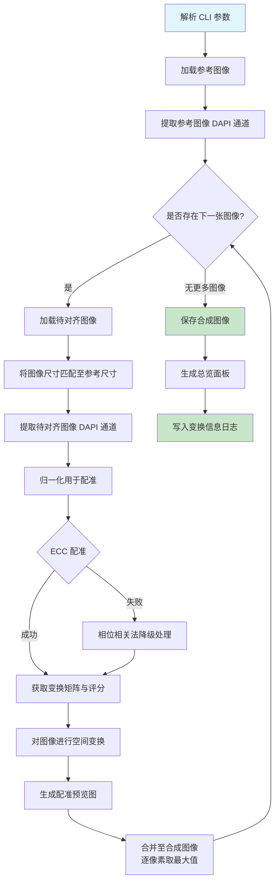
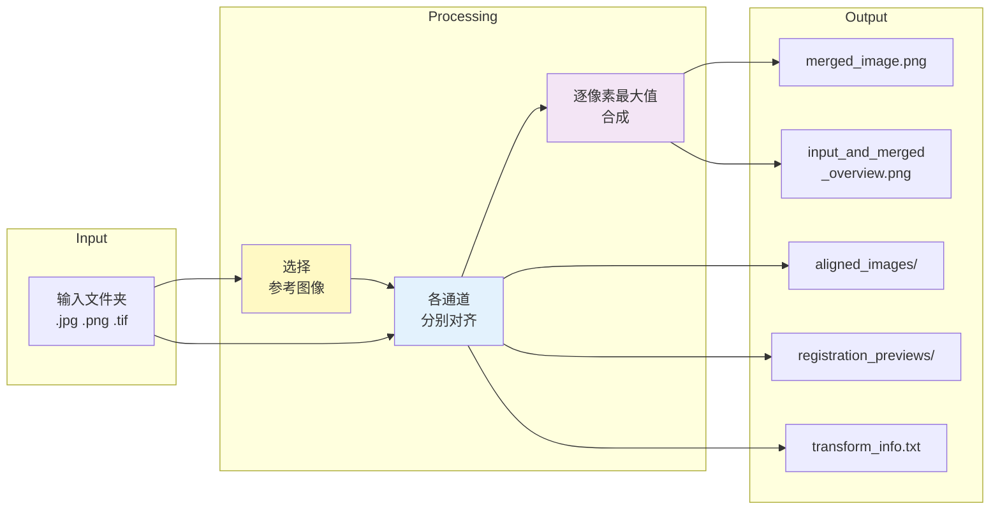

# ColorDeck 开发者文档

## 概述

ColorDeck 是一款用于**对齐与合并多重免疫荧光（MIF）显微图像**的 Python 工具。它将来自同一组织样本在不同波长下采集的多通道荧光图像集合作为输入，通过将所有通道配准到参考图像，输出一张精确对齐的合成图像。

---

## 架构设计

### 项目结构

```
colordeck/
├── merge_mif_images.py          # 主入口及核心逻辑
├── 6-PLEX_10X/                  # 示例输入数据（10x 放大倍率）
│   └── merged_output_YYYYMMDD_HHMMSS/
│       ├── aligned_images/      # 各通道对齐后的图像
│       ├── registration_previews/ # 配准质量检查叠加图
│       ├── merged_image.png     # 最终合成图像
│       ├── input_and_merged_overview.png
│       └── transform_info.txt   # 详细变换矩阵记录
├── ColorDeck_15x/
├── ColorDeck_test image/
└── ...
```

### 核心依赖

| 包名 | 用途 |
|------|------|
| `opencv-python` (`cv2`) | 图像读写、几何变换、ECC 配准 |
| `numpy` | 数组运算、矩阵运算 |
| `pathlib`（标准库） | 跨平台路径处理 |
| `argparse`（标准库） | 命令行参数解析 |

---

## 处理流程



### 整体流程说明

ColorDeck 的处理逻辑以**参考图像为核心驱动**，采用单通道锚点对齐策略完成多通道融合。整个流程可划分为以下阶段：

**准备阶段**：程序启动后首先解析命令行参数，定位输入文件夹并加载参考图像。用户需指定一个参考通道（通常为 DAPI，即细胞核染色通道），该通道包含清晰的组织解剖学特征，作为所有其他通道对齐的锚点。所有待处理图像按文件名排序后逐一进入主循环。

**尺寸归一化阶段**：由于不同通道的图像可能来自不同的采集设置，彼此之间存在尺寸差异。在进行配准之前，所有图像（包括参考图像和待对齐图像）均需统一至相同分辨率。若某图像尺寸大于参考图像，则进行中心裁剪；若尺寸小于参考图像，则使用双线性插值或像素重采样进行放大。这一归一化步骤确保配准算法在统一的搜索空间内运作。

**配准阶段**：这是整个流程的核心环节。配准以参考图像的 DAPI 通道为固定模板（Fixed），以待对齐图像的 DAPI 通道为移动模板（Moving）。首先对两个通道进行浮点归一化并施加轻度高斯模糊，以降低图像噪声对相关计算的干扰。随后程序优先尝试使用 ECC（增强相关系数）算法进行变换矩阵估计——该算法在高相关性区域具有较高的亚像素精度。若 ECC 失败且用户指定的运动模型为纯平移（translation），则降级至相位相关法（phaseCorrelate）作为备选方案，获取一个粗略的平移量后继续流程。估计得到的 2×3 仿射变换矩阵记录了待对齐图像相对于参考图像的位移和旋转信息。

**空间变换与合成阶段**：获得变换矩阵后，待对齐图像通过反向变形（warp）操作映射至参考图像的坐标空间。变形后的图像以**逐像素最大值**策略与已有的合成结果进行合并，即对于每个像素位置，保留所有通道中强度最高的值。这一策略确保了来自每个荧光通道的信号均得到完整保留，不会因叠加而相互掩盖。对齐后的图像同时被保存至 `aligned_images/` 目录，并生成一张红绿伪彩色叠加图（红 = 参考通道，绿 = 对齐后通道，黄 = 重叠良好）保存至 `registration_previews/` 目录，供操作者人工检查配准质量。

**收尾阶段**：所有通道处理完毕后，程序生成一张总览面板（包含所有输入图像缩略图与最终合成结果）保存为 `input_and_merged_overview.png`，同时将每张图像的配准评分、变换矩阵、尺寸调整方式等关键信息写入 `transform_info.txt`，便于后续数据分析追溯。

### 各步骤说明

#### 1. 图像尺寸匹配（`match_image_size`）

当输入图像尺寸不一致时，需在配准前进行标准化：

```python
def match_image_size(image, target_size):
    # 尺寸较大 → 中心裁剪
    # 尺寸较小 → 使用 INTER_AREA / INTER_LINEAR 缩放
```

- **尺寸更大的图像**：中心裁剪至目标尺寸
- **尺寸更小的图像**：使用 `cv2.INTER_LINEAR` 缩放
- **尺寸相同**：不做任何修改

#### 2. DAPI 通道归一化（`normalize_for_registration`）

DAPI（细胞核）通道作为对齐的解剖学锚点：

```python
def normalize_for_registration(channel):
    # 1. 转换为 float32
    # 2. 最小-最大归一化至 [0.0, 1.0]
    # 3. 高斯模糊（σ=2.0）降低噪声敏感性
```

#### 3. 变换矩阵估计

按顺序尝试以下两种配准方法：

**首选 — ECC（增强相关系数）**

```python
def estimate_transform_ecc(fixed, moving, motion_type):
    # 使用 cv2.findTransformECC，参数如下：
    #   max_iterations = 300
    #   epsilon = 1e-6
    #   gaussian_filter_size = 5
```

**降级方案 — 相位相关法**（仅在 ECC 失败且 motion=`translation` 时触发）

```python
def estimate_transform_phase_correlation(fixed, moving):
    # 使用 cv2.phaseCorrelate 进行粗略平移估计
    # 返回带亚像素偏移的 2x3 单位仿射矩阵
```

#### 4. 图像空间变换（`warp_image`）

```python
def warp_image(image, warp, motion_type, size):
    if motion_type == MOTION_HOMOGRAPHY:
        return cv2.warpPerspective(image, warp, size, ...)
    else:
        return cv2.warpAffine(image, warp, size, ...)
```

#### 5. 配准预览图（`create_registration_preview`）

生成伪彩色叠加图用于质量评估：

| 颜色 | 含义 |
|------|------|
| **红色** | 参考图像的 DAPI 通道 |
| **绿色** | 对齐后待配准图像的 DAPI 通道 |
| **黄色** | 完全重叠（两通道对齐良好） |

#### 6. 图像合并策略

最终合成采用**逐像素最大值投影**：

```python
merged = np.maximum(merged, aligned_image)
```

此策略确保来自每个通道的信号均不被覆盖。

---

## 命令行接口

```bash
python merge_mif_images.py \
    --input-folder "6-PLEX_10X" \
    --reference-image "R2_CD68_RF 525+DAPI.jpg" \
    --dapi-channel b \
    --motion translation \
    --output-dir merged_output
```

### 参数说明

| 参数 | 默认值 | 说明 |
|------|--------|------|
| `--input-folder` | `ColorDeck_test image` | 包含待处理图像的文件夹 |
| `--reference-image` | `1_Spleen_DAPI...` | 参考图像的文件名 |
| `--dapi-channel` | `b` | 用作 DAPI 锚点的 RGB 通道：`b`(蓝)、`g`(绿)、`r`(红) |
| `--motion` | `translation` | 配准模型：`translation`、`euclidean`、`affine` |
| `--output-dir` | `merged_output` | 输出文件夹名称（自动添加时间戳） |

### 运动模型选择指南

| 模型 | 自由度 | 适用场景 |
|------|--------|----------|
| `translation` | 2（dx, dy） | 视野相同，仅有轻微位移 |
| `euclidean` | 3（dx, dy, θ） | 旋转 + 平移 |
| `affine` | 6（dx, dy, θ, sx, sy, shear） | 复杂几何畸变 |

> **建议**：首先使用 `translation`。仅在配准评分较差时再增加模型复杂度。

---

## 输出文件说明

### `aligned_images/`

每张输入图像经对齐后保存至此目录。参考图像本身也会被复制一份。

### `registration_previews/`

伪彩色叠加图，用于质量控制。对齐不良的通道呈现大片纯红或纯绿色，而非黄色。

### `merged_image.png`

最终合成图像——每像素取所有对齐通道中的最大强度值。

### `input_and_merged_overview.png`

网格面板，展示：
- 所有输入图像（含标签）
- 最终合成结果

用于快速目视验证。

### `transform_info.txt`

所有配准结果的机器可读日志：

```ini
[6-PLEX_10X]
[R2_CD68_RF 525+DAPI.jpg]
method: reference
score: 1.0
size_adjustment: none
warp_matrix:
1.00000000 0.00000000 0.00000000
0.00000000 1.00000000 0.00000000

[R1_CD3_RF 675+DAPI-2.jpg]
method: ECC
score: 0.8812083825525117
size_adjustment: none
warp_matrix:
1.00000000 0.00000000 0.54518598
0.00000000 1.00000000 4.01117277
```

**字段说明：**
- `score`：ECC 相关系数（0–1），越高代表对齐越好
- `method`：`ECC`、`phase_correlation` 或 `reference`
- `size_adjustment`：图像为匹配参考尺寸所做的裁剪/缩放处理

---

## 配准质量评判标准

| 评分范围 | 质量等级 | 建议操作 |
|----------|----------|----------|
| 0.95 – 1.00 | 优秀 | 最佳对齐状态 |
| 0.70 – 0.95 | 良好 | 适用于大多数分析场景 |
| 0.40 – 0.70 | 一般 | 检查视野重叠，考虑更换参考图像 |
| < 0.40 | 较差 | 配准可能已失败，需审查图像 |

**实际数据示例（6-PLEX_10X 数据集）：**

| 图像文件 | 评分 | 状态 |
|----------|------|------|
| R2_CD68_RF 525+DAPI.jpg | 1.0000 | 参考图像 |
| R2_KI67_RF 555+DAPI.jpg | 0.9999 | 优秀 |
| R1_Lamin B1_RF 775+DAPI-2.jpg | 0.9176 | 良好 |
| R1_CD3_RF 675+DAPI-2.jpg | 0.8812 | 良好 |
| Spleen_CD31_Cy3_DAPI.tif | 0.1705 | 较差（放大倍率/视野不同） |
| Spleen_CD206_Cy5_DAPI.tif | 0.1570 | 较差（放大倍率/视野不同） |

Spleen 图像评分较低，是因为其来源于与 R1/R2 区域不同的视野/放大倍率，属于数据集本身特性，而非配准算法问题。

---

## 核心函数参考

### `load_image(path)` → `np.ndarray`

通过 `cv2.imdecode` 读取图像文件，支持多种格式。

### `save_image(path, image)` → `None`

通过 `cv2.imencode` + 原始字节写入保存图像（规避了 `cv2.imwrite` 在 Windows 上的 Unicode 路径问题）。

### `fit_image_to_box(image, max_width, max_height)` → `np.ndarray`

在保持宽高比的前提下，将图像缩放至限定宽高内。

### `create_overview_panel(images)` → `np.ndarray`

生成格式统一的带标签图像网格面板。

### `build_timestamped_output_dir(input_folder, output_dir_arg)` → `Path`

创建带时间戳的输出目录，命名格式：`{output_dir}_{YYYYMMDD_HHMMSS}`。

---

## 数据流图



---

## 使用示例

```bash
# 对齐 10x 数据集，以 CD68 通道为参考图像
python merge_mif_images.py \
    --input-folder "6-PLEX_10X" \
    --reference-image "R2_CD68_RF 525+DAPI.jpg" \
    --dapi-channel b \
    --motion translation

# 处理 20x 测试数据集，使用欧式运动模型
python merge_mif_images.py \
    --input-folder "ColorDeck_test image" \
    --reference-image "1_Spleen_DAPI_Lamin B1_RF 775_下_20.0x.jpg" \
    --motion euclidean
```

---

## 默认参数

ColorDeck 在不指定任何参数的情况下使用以下默认配置运行：

| 参数 | 默认值 | 说明 |
|------|--------|------|
| `--input-folder` | `ColorDeck_test image` | 指向项目自带的测试图像文件夹 |
| `--reference-image` | `1_Spleen_DAPI_Lamin B1_RF 775_下_20.0x.jpg` | 以 Lamin B1 通道图像作为参考锚点 |
| `--dapi-channel` | `b` | 使用蓝色通道（即 DAPI 通道）作为配准基准 |
| `--motion` | `translation` | 仅估计平移变换，最安全、对噪声最鲁棒 |
| `--output-dir` | `merged_output` | 输出目录前缀，时间戳自动追加 |

这意味着在不传入任何参数的情况下，直接运行以下命令即可完成一次标准对齐与合成：

```bash
python merge_mif_images.py
```

程序将以 `ColorDeck_test image` 文件夹中的 `1_Spleen_DAPI_Lamin B1_RF 775_下_20.0x.jpg` 为参考，使用蓝色通道作为 DAPI 锚点，采用纯平移模型进行配准，最终输出至自动生成的时间戳目录中。
